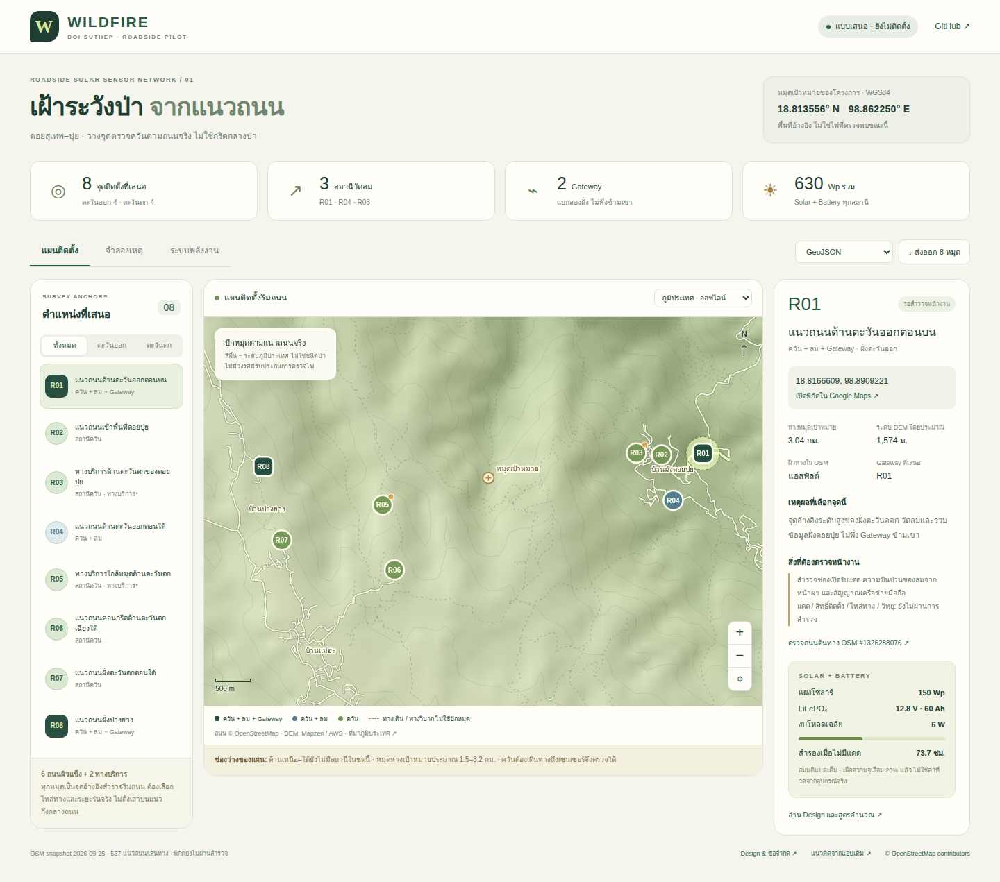

# Wildfire — เฝ้าระวังป่าจากแนวถนน

แอปและ Design ใหม่สำหรับพื้นที่อ้างอิง **18.813555556, 98.862250000** รอบดอยสุเทพ–ปุย โดยไม่แก้แอปเดิม `bdteamditto/fire`.

**แบบเสนอ:** เซนเซอร์ริมถนน 8 จุด ใช้ **Solar panel + Battery ทุกจุด** ไม่วางเป็นกริดในป่า แบ่งฝั่งตะวันออก 4 จุดและตะวันตก 4 จุด มี AQ 8 ชุด, วัดลม 3 จุด และ Gateway 2 จุด ข้อมูลถนนและภูมิประเทศมีแหล่งที่มา ส่วนค่าควันและแนวลามเป็นฉากจำลอง ไม่ใช่ระบบแจ้งเหตุจริง

## เข้าใช้งาน

**GitHub Pages URL เมื่อขั้น Deploy สำเร็จ:** https://saratchai1.github.io/wildfire/ . ตรวจผลจริงที่ [Actions](https://github.com/saratchai1/wildfire/actions/workflows/validate-deploy.yml) ไม่ถือว่า URL นี้เผยแพร่แล้วเพียงเพราะมีใน README.

เปิด `index.html` จากโฟลเดอร์ repository ที่ดาวน์โหลดครบได้โดยตรง หรือรัน:

```bash
python -m http.server 8000
```

แล้วเปิด `http://localhost:8000` . แผนที่ภูมิประเทศ ถนน หมุด รายละเอียด การจำลองและส่งออกทำงานโดยไม่ต้องพึ่ง CDN หรือ backend. ภาพดาวเทียม/แผนที่ฐานออนไลน์ต้องใช้อินเทอร์เน็ต และมี fallback เมื่อโหลดไม่ได้

[Design packet](docs/DESIGN.md) · [ตำแหน่งและชุดอุปกรณ์](data/plan.js) · [ผล browser QA ล่าสุด](qa/latest.json)

## สิ่งที่ใช้งานได้

- **แผนติดตั้ง:** ถนน OSM จริง, DEM Mapzen, คลิกหมุด/รายการสถานี, กรองฝั่ง, ซูม/เลื่อน, ลิงก์ Google Maps และ OSM way ของแต่ละจุด
- **จำลองเหตุ:** PM + CO, ฝุ่นถนนที่เพิ่มเฉพาะ PM และขาดข้อมูลฝั่งตะวันตก; ปรับทิศ/ความเร็วลม จุดเริ่ม เวลา และอัตราลามตั้งต้น; รับทราบเหตุเฉพาะฉาก
- **ระบบพลังงาน:** ปรับชั่วโมงแดด เงาบัง และโหลด แยกผลผลิต PV ออกจากชั่วโมงสำรองแบตเตอรี่ รวมการเผื่อความจุเสื่อมแล้ว
- **ส่งออก:** GeoJSON, CSV, KML มี 8 พิกัดตรงกับแผนและสถานะจุดเสนอสำรวจ
- **Desktop / mobile:** แผนที่และข้อมูลแสดงแบบปรับตามหน้าจอ ไม่มี login, API key, sensor feed หรือการแจ้งเตือนจริงในรุ่นนี้

## หมุดที่เสนอ

ทุกพิกัดเป็น **จุดอ้างอิงสำรวจบนแนวถนน OSM ไม่ใช่พิกัดฐานรากที่อนุมัติ** ต้องเลือกไหล่ทางและระยะร่นจริงกับหน่วยงานเจ้าของทาง

| จุด | Latitude | Longitude | ชุดอุปกรณ์ | Solar / Battery |
|---|---:|---:|---|---|
| R01 | 18.8166609 | 98.8909221 | AQ + ลม + Gateway | 150 Wp / 12.8 V 60 Ah |
| R02 | 18.8164598 | 98.8853976 | AQ | 50 Wp / 12.8 V 20 Ah |
| R03* | 18.8167034 | 98.8820312 | AQ | 50 Wp / 12.8 V 20 Ah |
| R04 | 18.8107123 | 98.8869523 | AQ + ลม | 80 Wp / 12.8 V 30 Ah |
| R05* | 18.8101230 | 98.8481055 | AQ | 50 Wp / 12.8 V 20 Ah |
| R06 | 18.8019146 | 98.8496934 | AQ | 50 Wp / 12.8 V 20 Ah |
| R07 | 18.8056821 | 98.8346230 | AQ | 50 Wp / 12.8 V 20 Ah |
| R08 | 18.8149905 | 98.8321842 | AQ + ลม + Gateway | 150 Wp / 12.8 V 60 Ah |

\* R03 และ R05 เป็น **ทางบริการไม่ลาดยาง** จึงมีเงื่อนไขการเข้าถึงและต้องสำรวจแดดก่อน ไม่ใช่ทางเดินเท้าที่ถูกเปลี่ยนชื่อเป็นถนน

## ขอบเขตที่ไม่ควรตีความเกินหลักฐาน

หมุดอยู่ห่างเป้าหมายประมาณ **1.5–3.2 กม.** และยังมีช่องว่างด้านเหนือ–ใต้ ไม่รับประกันตรวจไฟทุกจุดหรือภายในเวลาตายตัว ไม่มีวงกลมสมมติว่าครอบคลุมการตรวจไฟ ถนนไม่ได้รับประกันแสงแดดตลอดวัน ทุกจุดยังต้องตรวจเงาต้นไม้/ภูเขา สิทธิ์ติดตั้ง ความปลอดภัยไหล่ทาง และสัญญาณวิทยุ

การจำลองแนวลามเป็น **illustrative ellipse** ที่อาศัยลมกำหนดเองและความลาดชันเฉพาะจุดจาก DEM ไม่ใช่ FARSITE/WindNinja หรือโมเดลที่สอบเทียบแล้ว ไม่ใช้กำหนดเขตปลอดภัยหรือเส้นทางหนีไฟ หมุดเป้าหมายเป็นพิกัดที่ผู้ใช้เลือก ไม่ใช่หลักฐานไฟป่าซ้ำซากที่ตรวจสอบแล้ว

## พลังงานตั้งต้น

งบเฉลี่ย AQ 1 W, AQ + ลม 2 W, HUB 6 W. สมมติแดดเทียบเท่าเต็มกำลัง 3 ชั่วโมง/วัน, derate แผง 70%, DoD 80%, ประสิทธิภาพแบต 90%, ความจุเมื่อเสื่อม 80%. ได้เวลาสำรองไร้แดดประมาณ **147.5 / 110.6 / 73.7 ชั่วโมง** ตามลำดับ จากแบตเต็ม เป้าหมาย ≥72 ชั่วโมง **ไม่ใช่ผลทดสอบอุปกรณ์จริง** รวมแผง 630 Wp และแบต nominal 3.20 kWh. การเพิ่มกล้อง/เราเตอร์/อุปกรณ์อื่นต้องคำนวณใหม่

## พัฒนาและทดสอบ

ไม่มี npm dependencies สำหรับตัวแอป ต้องมี Node.js 22 สำหรับชุด unit/geospatial tests และ build:

```bash
node --test tests/core.test.cjs
node scripts/build.cjs
python -m http.server 4173 --directory site
```

Browser tests (อีก terminal):

```bash
pip install playwright==1.55.0
python -m playwright install chromium
python tests/browser.py
```

Workflow `validate-deploy.yml` ตรวจ syntax, unit/geospatial integrity, browser workflows และ mobile ก่อน publish. ดาวน์โหลด zip แอปพร้อมใช้กับ screenshots ได้จาก artifact `wildfire-qa-and-portable-app` ใน Actions. ผลพิกัดจะตรวจระยะจาก **polyline ต้นฉบับ** ไม่ใช่แค่เส้นที่ simplify เพื่อแสดงบนแผนที่

ครั้งแรกของ GitHub Pages อาจต้องเลือก **Settings → Pages → Build and deployment → Source: GitHub Actions** หาก workflow ไม่มีสิทธิ์เปิด Pages แล้วกด Run workflow อีกครั้ง ผล test ผ่านกับผล deploy สำเร็จเป็นคนละสถานะ

## แหล่งข้อมูล

ถนน © OpenStreetMap contributors, ODbL 1.0; snapshot, query และ SHA-256 ใน `data/context.json` และ raw response `data/osm-source.json`. DEM จาก Mapzen Terrarium / AWS Open Data, sample zoom 12, กริด 65×65 ประมาณ 140 ม. ไม่ใช่แบบสำรวจรังวัด ภาพฐานออนไลน์ระบุเครดิตในแอป. รายละเอียดแหล่งอ้างอิงทางเทคนิคอยู่ท้าย [Design packet](docs/DESIGN.md)


